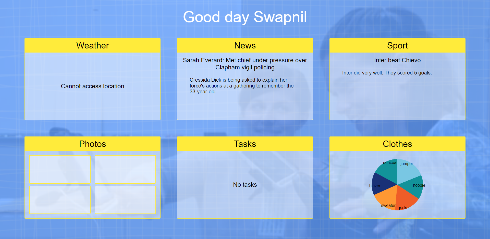

# Therapy Box Challenge


## About this Project

The website challenge for Therapy Box company



Therapy Box didn't have the courtesy to leave me an email/call to decline my application after spending >30 hours completing their hiring process, so I'm using their challenge as a project on my portfolio.

- Day 1: 3 hours (design implementations)
- Day 2: 5 hours (express, weather, news, and sport)
- Day 3: 6 hours (database, login system)
- Day 4: 3 hours (tasks, clothes/warmer)
- Day 5: 3 hours (hosting, refactor backend)
- Day 6: 5 hours (photo uploading, storage, viewing)
- Day 7: 1 hours (register photo)

Total: 26 hours

### Built with

- React & React Router
- Express
- MongoDB & mongoose & GridFS
- Webpack
- Babel
- Sass
- Passport & bcrypt
- Mutler & Jimp
- react-vis (Uber)
- rss-parser & csv-parser

## Getting Started

### Prerequisites

- Node
- MongoDB running locally

### Installation

1. Install the dependencies.

```
npm i
```

2. Run the build tool.

```
npm run build-w
```

3. Run the back-end.

```
npm run dev-server
```

Go to http://localhost

## Deployment

This project was hosted on AWS Lightsail.

1. Build the static pages.

```
npm run generate
```

2. Commit:

```
git push
```

3. Go to the Lightsail console.

4. Press `Connect using SSH`.

5. Install MongoDB.

6. Run:

```
cd projects/TherapyBox
```

```
forever stopall
```

```
git pull
```

```
npi i
```

```
forever start index.js
```

See usage

## Usage

This project is designed for desktop only. This app is no longer up.

~~http://3.11.144.124:8080/~~

## Roadmap

No planned features

## Release History

- v0.1.3
  - Register photo
- v0.1.2
  - Image uploading
- v0.1.1
  - Tasks
  - Clothes
- v0.1.0
  - Login system
  - Database
  - Weather
  - News
  - Sports
